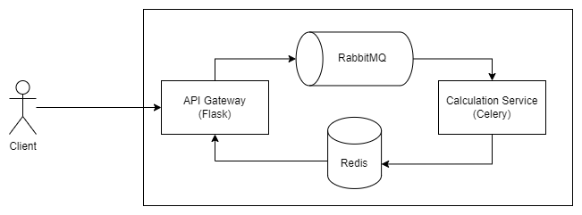

# Simple Calculator Service
## Architecture:
Consists of 2 services:
- Flask API gateway service
- Celery calculation service

To communicate with each other, this project uses Celery's default messaging method, which uses RabbitMQ to transport
the data to Celery's calculation service, stores the result into Redis and the caller polls to Redis to retrieve the answer.

Celery allows for time consuming calculations to not block the main API service and handles it in a thread (or greenthreads) in the calculation service managed by Celery.

